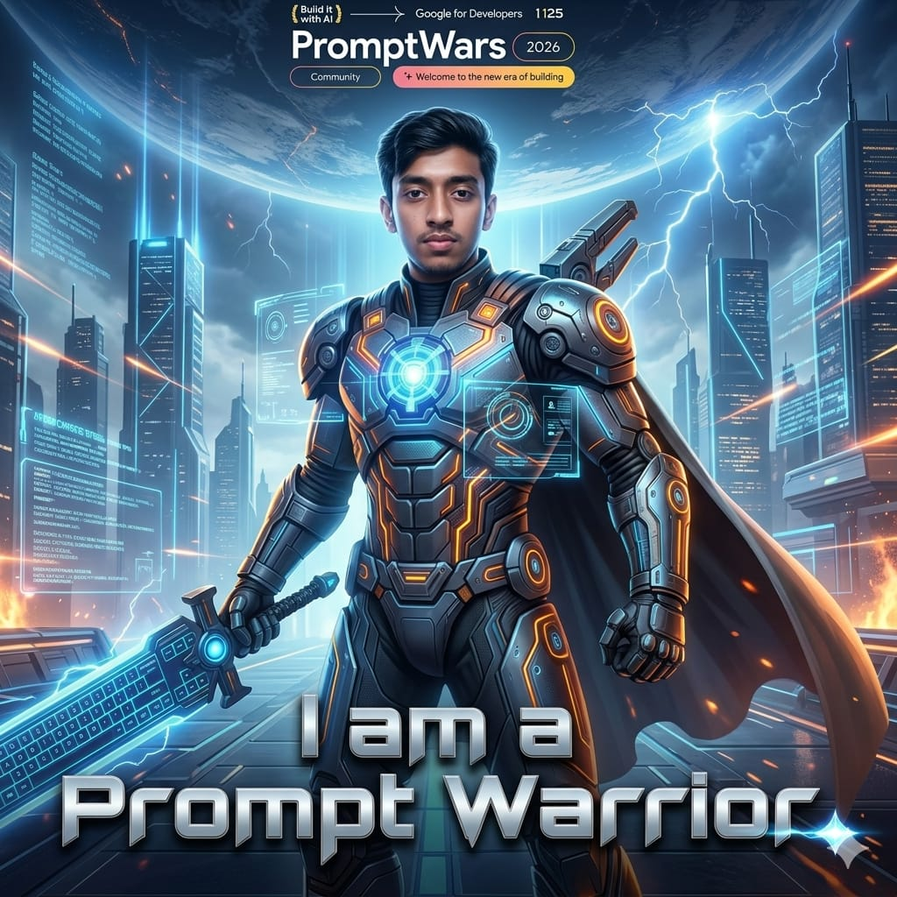

# PromptWars 2026 - Mini Challenge 2

## Objective
Create a Prompt Warrior poster using AI.

## Tools Used
- Gemini
- Image Generation AI

## Prompt
Create an ultra-premium cinematic 1:1 hero poster using the attached participant photo as the exact facial reference and the attached event logo as the exact branding element.

PRIMARY OBJECTIVE
Transform the participant into a legendary “Prompt Warrior” hero inspired by the cinematic intensity, epic scale, and visual power of blockbuster universes like Star Wars, Avengers, Tron, and futuristic sci-fi fantasy films — while preserving the participant’s exact identity.

The final artwork should feel like an official billion-dollar sci-fi movie poster featuring the participant as the lead hero of PromptWars.

MANDATORY TEXT REQUIREMENT
The final image MUST clearly and correctly display this exact caption at the bottom:

"I am a Prompt Warrior"

IMPORTANT:
●	The text must be perfectly readable
●	No spelling mistakes
●	No distorted or AI-generated gibberish typography
●	Use premium cinematic movie-poster typography
●	Metallic futuristic lettering with glowing energy accents
●	Ensure the text is sharp, centered, and highly legible

IDENTITY PRESERVATION (MANDATORY)
●	Use the uploaded participant photo as the strict facial reference
●	Preserve the exact face, eyes, expression, hairstyle, beard, skin tone, and facial proportions
●	The participant must remain instantly recognizable
●	Do not distort the face
●	Do not hide the face behind helmets or masks
●	Maintain realistic anatomy and proportions
VISUAL STYLE
●	Hyper-detailed cinematic digital art
●	Premium blockbuster movie-poster aesthetic
●	Realistic sci-fi fantasy styling
●	Avengers-level heroic energy
●	Star Wars-inspired cinematic atmosphere
●	Unreal Engine quality lighting and detailing
●	High-end VFX look
●	Volumetric cinematic lighting
●	Dramatic shadows
●	Rich textures and metallic surfaces
●	Ultra-sharp facial detail
●	Dynamic action-poster composition
●	Cinematic color grading
●	Epic visual storytelling

STRICTLY AVOID
●	Cartoon style
●	Anime style
●	Crayon style
●	Childish illustration
●	Plastic CGI skin
●	Generic AI portrait look
●	Flat composition
●	Weak colors
●	Low-detail artwork
●	Blurry textures
●	Distorted anatomy
●	Gibberish text
●	Misspelled caption

PROMPT WARRIOR TRANSFORMATION
Transform the participant into an elite futuristic AI warrior standing at the center of a massive digital battlefield.

Armor and Costume:
●	Futuristic AI battle armor
●	Metallic tactical suit with glowing circuitry
●	Electric blue and fiery orange energy accents
●	Holographic chest reactor
●	Mechanical shoulder armor
●	Cinematic flowing cape
●	Futuristic combat gloves
●	Advanced tech detailing
Weapons and Power Elements:
●	Massive glowing keyboard-energy sword

●	Floating holographic prompts
●	AI command interfaces
●	Digital energy shards
●	Neural-network visual effects
●	Holographic code streams
●	Floating futuristic UI panels
Environment:
●	Futuristic cyber city
●	Massive glowing skyscrapers
●	AI battlefield atmosphere
●	Cinematic storm clouds
●	Lightning streaks
●	Holographic data streams
●	Futuristic warzone ambiance
●	Epic sci-fi sky
MOOD
The participant should feel:
●	Powerful
●	Heroic
●	Fearless
●	Elite
●	Intelligent
●	Inspirational
●	Battle-ready
●	Like the main character of an epic sci-fi universe

COMPOSITION
●	Square 1:1 cinematic poster
●	Chest-up or mid-shot framing
●	Participant centered as the dominant hero
●	Dynamic cinematic camera angle
●	Strong depth and layering
●	Intense cinematic lighting on the face
●	Glowing energy surrounding the warrior
●	Poster-quality framing

BRANDING
●	Place the attached event logo centered at the top EXACTLY as provided
●	Preserve original logo colors, typography, proportions, and spacing
●	Do not stylize, redraw, distort, or reinterpret the logo

TYPOGRAPHY
At the bottom of the poster, prominently display:
"I am a Prompt Warrior"

Typography should be:
●	Sharp
●	Cinematic
●	Futuristic
●	Metallic
●	Highly readable
●	Professionally typeset
●	High contrast against the background

VISUAL EFFECTS
●	Cinematic lens flares
●	Energy sparks
●	AI particles
●	Neon reflections
●	Atmospheric fog
●	Motion streaks
●	Volumetric glow
●	Holographic lighting
●	Epic sci-fi energy effects

PROMPTWARS ATMOSPHERE

Capture the spirit of PromptWars:
an elite high-stakes AI battleground where the world’s smartest builders compete using creativity, prompting, and innovation under pressure.

FINAL OUTPUT QUALITY
The final artwork should look visually breathtaking, hyper-premium, cinematic, emotionally powerful, and impossible to ignore on LinkedIn.

NEGATIVE PROMPT
No anime style, no cartoon style, no crayon style, no childish illustration, no distorted face, no blurry textures, no weak composition, no low-detail armor, no fake AI look, no plastic skin, no gibberish text, no misspelled caption.

## Output

